# Jmeter Tutorial

Meter is an open-source software tool designed for performance testing and load testing. It helps check how well websites, applications, or APIs perform under different levels of user traffic. Originally built for testing web applications, it can now test a wide range of services.

### Key Features:
 - Simulates multiple users to mimic real-world traffic.
 - Measures performance by tracking response times, errors,  and resource usage.
 - Supports different protocols, such as HTTP, FTP, database connections, and more.
 - Open-source and easy to extend with plugins.
 
In short, JMeter is used to test whether a system can handle heavy traffic and ensure it performs reliably under load.

Below are the various features/options available in Jmeter

## ThreadGroups

ThreadGroups helps create the Threads/Virtual Users(VUs) to simulate the real time traffic of the application 

- To add a **ThreadGroup**, right click on the Test Plan option and select Add -> Threads -> ThreadGroup

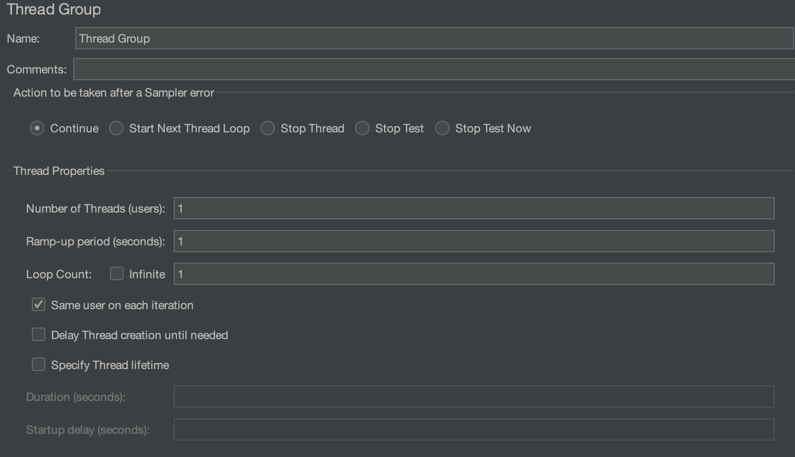

### Various options in ThreadGroup

- Number of threads : Number of VUs to be used in the load test
- Ramp-up period : Time it takes to reach the desired concurrent users(to increase the user count in a slow manner)
- Loop count : Number of iterations
- Scheduler : Helps define the duration of the test. After selecting scheduler check box duration and start up delay fields are enabled
    - Duration : execution time for the load test  
- Actions to be taken after sampler error
    - Continue : continue the test
    - Start next threadloop : Stop the current threadloop and proceed with next threadloop
    - Stop Thread : Stop the current Thread
    - Stop test : Stop the entire test gracefully
    - Stop : Stop the entire test immediately 

### ThreadGroup execution Order:
- If there are multiple thread groups then by default they are executed in parallel
- If the requirement is to run the ThreadGroup sequentially then in the test plan option select the checkbox “run thread groups consequently”

## Config Elements 

### HTTP Request Defaults

To main goal of HTTP Request Defaults is to avoid duplication of configuration by setting defaults. Example : server, port, protocol(http/https) details of the application undertest can be configured under this config element 

To Add **HTTP Request Defaults** right click on the Test Plan option and select Add -> Config Element -> HTTP Request Defaults

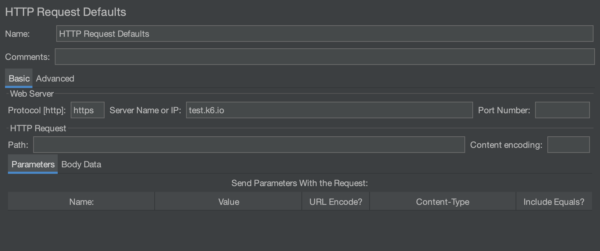

### HTTP Header Manager: 

HTTP Header manager helps maintain default headers for all samplers/requests. Headers added to HTTP Header Manager element would be added to all samplers which in the scope of the header manager entry. 

To Add **HTTP Header Manager** right click on the Test Plan option and select Add -> Config Element -> HTTP Header Manager

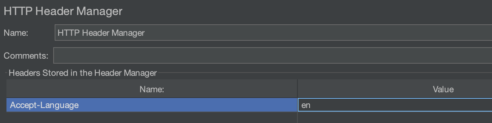

### HTTP Cache Manager

The HTTP Cache Manager simulates the browser’s caching behavior. This feature can be used to reduce the traffic on the internet(to avoid sending requests for which the required info is already present in the cache). The first request gets the required info from the server and the info is cached with a validity which will be used by similar subsequent requests can use this cached info until the validity expires. 

- Cache Manager provides an option to definite the number of entries in the cache. By default it is 5000.
- Option available to clear cache after each iteration 

To Add **HTTP Cache Manager** right click on the Test Plan option and select Add -> Config Element -> HTTP Cache Manager

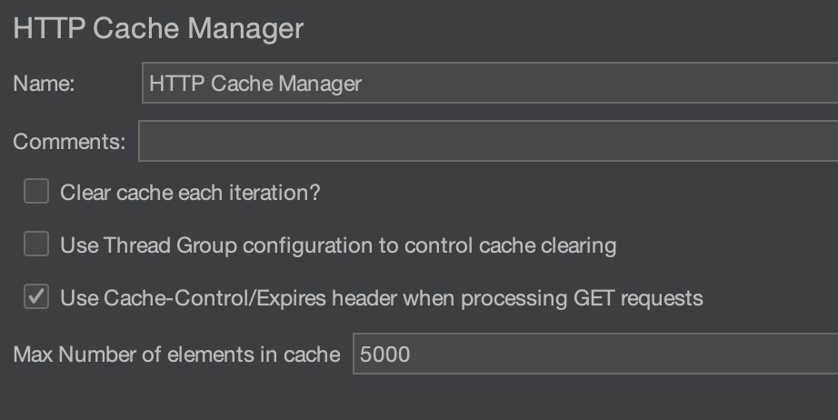

### HTTP Cookie Manager

The HTTP Cookie Manager saves the cookies received in the responses and later will be used by the subsequent requests. Each Jmeter thread has its own cookie storage area. 

- Option available to clear cookies after each iteration

To Add **HTTP Cookie Manager** right click on the Test Plan option and select Add -> Config Element -> HTTP Cookie Manager

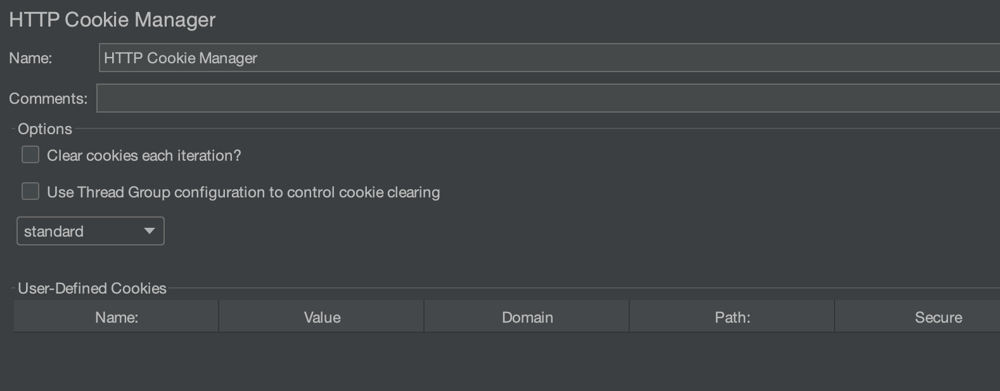

### DNS Cache Manager

DNS Cache Manager is allows you to manage the DNS caching behavior for your test scripts. By default, JMeter relies on the DNS caching mechanism provided by the Java Virtual Machine (JVM), which can hold DNS results in cache indefinitely or for a fixed period of time. However, in certain testing scenarios, especially when testing against distributed environments, CDNs (Content Delivery Networks), or load balancers, you might want more control over how DNS resolution is handled.

- You can specify a list of custom DNS servers 
- You can define the TTL for DNS records, specifying how long a DNS entry should be cached
- You have control over whether DNS records should be cached or not, and for how long. This helps when testing scenarios where DNS caching plays a critical role in the application’s performance.
- You can configure the DNS Cache Manager to provide specific DNS responses for certain hostnames, which allows you to override the default DNS resolution for particular domains. This can be useful for testing how your system behaves with different server IP addresses or in failover scenarios.

#### Options available 
- You can choose to use system provided DNS resolver or Custom DNS resolver. If Custom DNS resolver is selected, required hostnames/addresses needed to be added 
- You can choose to clear DNS Cache after each iteration

To Add **DNS Cache Manager** right click on the Test Plan option and select Add -> Config Element -> DNS Cache Manager

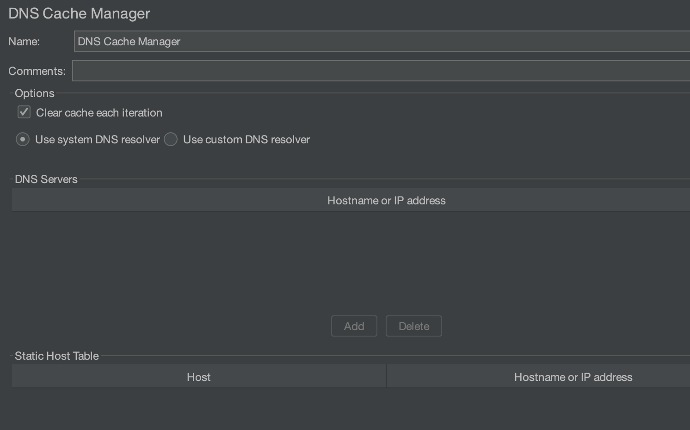

## Samplers 

### HTTP Request Sampler 

Commonly used request sampler to invoke HTTP requests. There are various fields available in HTTP Request Sampler which can made use of. Below are the few 

- Basic Tab
    - All basic details like request URL, request type, protocol, port, request body, headers, query params, file uploading option 

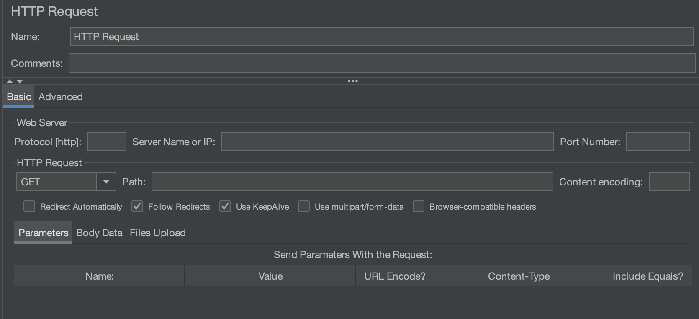

- Advanced Tab
    - Text fields for specifying request connect & response timeouts
    - Retrieve All Embeded resouces(like images, html, css, javascript etc) checkbox
    - Proxy details

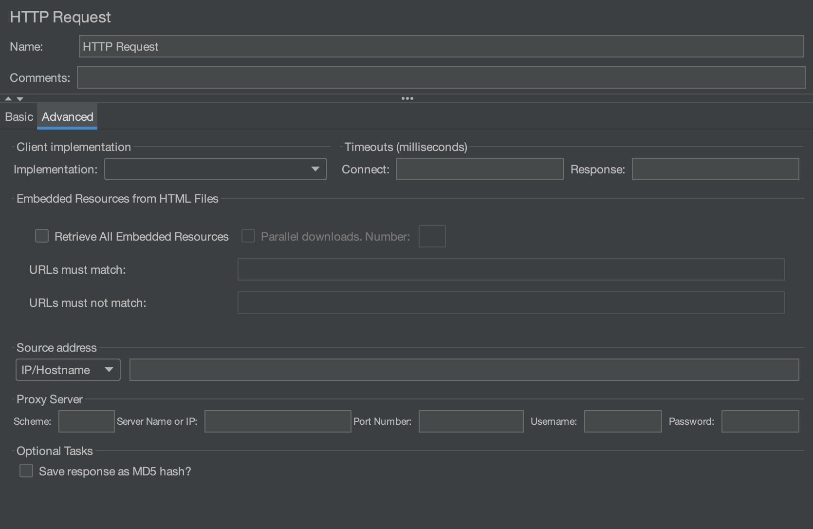

## Listeners

Listeners are special components that collect, visualize, and analyze the results of your test plans.

### Listeners in JMeter can be used to:

- Show test results in various formats (graphs, tables, trees, etc.).
- Save the results to a file for later analysis.
- Provide visual feedback about performance metrics like response times, throughput, error rates, and more.

To Add **Listeners** right click on the Test Plan option and select Add -> Listener -> "Select your required listener"

Below are the few frequently used Listeners

### View Results Tree

- Shows detailed test results for each sample (request-response) in a tree structure.
- Displays request details, response data, and headers.

### View Results Table

- Presents results in a tabular format with information like sample time, latency, and success status.

### Aggregate Report

- Provides a summary of results including average, minimum, maximum, throughput, and error percentage.
- It is one of the most commonly used listeners for analyzing performance trends.

### Summary Report

- Similar to the Aggregate Report, but simpler, showing key metrics like number of samples, average time, and error percentage.

Most of the listeners provide an option to write the data into files. 

## Controllers

### Simple Controller

### Transaction Controller

### If Controller

### While Controller

## Timers

 Timers introduce delay before running the samplers to mimic user waiting actions. Timers can be added from add -> timers menu

 ### Constant Timers 

 - Waits for constant time before running the sampler. 

 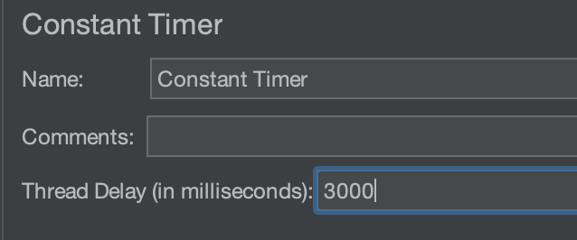

 ### Uniform Random Timers

 - Creates a random time between two given offsets and the sampler is executed after it waits for the random time

 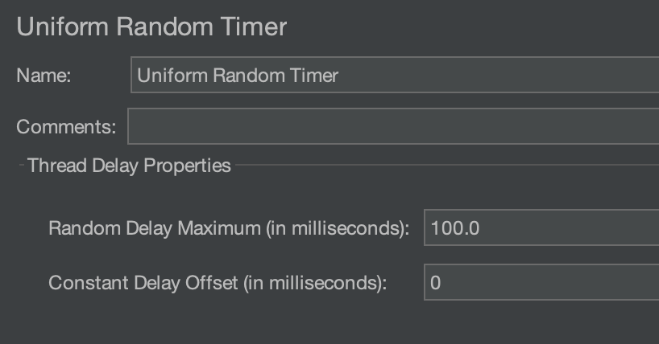

 ## Pacing Vs Thinktime

 Thinktime - refers to the delay introduced(using Timers like Constant Timer) between requests within one iteration. Note that these timers dont introduce any dealy between iteration usually 

 Pacing - refer to number of requests sent to server/application under test per second. Helps in controlling the interval between sessions

 ## Scoping Rules/Execution Order: 

 - Scope of an element may vary depending on the location of the element. For example you can have a listener within a transaction controller and the scope of the listener would be within the transaction controller only. Hence it is very important to place the element in the right location

## Execution order

- Each element has a priority and this defines the order of the execution of various element of a Jmeter test plan. Here is the order of execution of the elements 

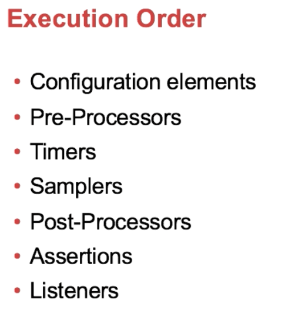

Example of a test plan and its order of execution

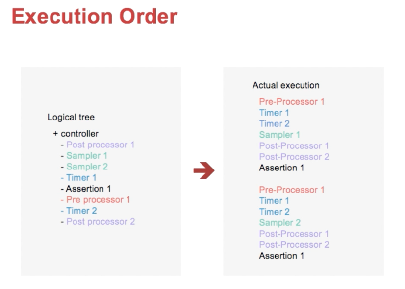

## Data Sets

- Jmeter provides a capability to read data from CSV files through **CSV Data Set Config** element. The **CSV Data Set Config** reads the data and would be directly loaded them into the Jmeter varaibles

Refer the below screenshot for basic config required for CSV Data Config. It requires the location of the file and few other options below 

- recycle at the EOF : reuse the data again after end of file 
- Sharing mode : Can share to all threads or change the default
- Stop thread on EOF : Stops the execution of thread once EOF is reached 

## Logging

